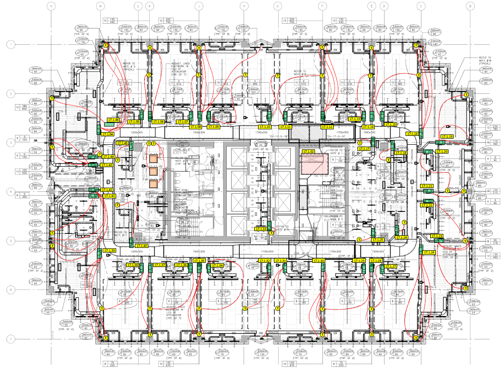
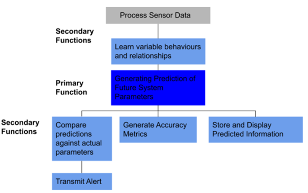
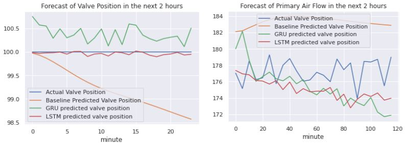
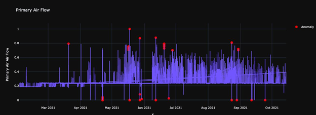
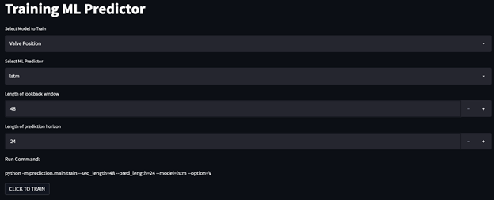

# ML-Based Predictive Maintenance Algorithm for HVAC Systems

### 2021.9 - 2022.4

## Problem Statement

The client for our capstone project is a mechanical and electrical contractor that provides building maintenance services in heating, ventilation, and air conditioning (HVAC) systems. Currently, maintenance is conducted manually through building operator calls and and scheduled servicing. The client would like to automate their building servicing process with AI-driven decision-making based on sensor data they collect from the HVAC systems. Specifically, a proof of concept that uses the sensor information to autonomously identify building system anomalies in the CPPIB building is required. 

## Design Proposal

After performing a literature review and examining the available datasets provided by the client, the team selected the Air Handling Central Unit (CU) and the Variable Air Volume (VAV) system for demonstration of proof-of-concept. By taking an in-depth look at the system components as well as their relationships through exploratory data analysis (EDA) and domain knowledge, we were able to identify two machine learning models: Valve Position and Air Flow. The chosen solution was a digital twin, a data-driven representation of the VAV and CU. The digital twin is generated through machine learning predictions. These predictions are then fed into an anomaly detector to forecast potential failures ahead of time.

## Design Implementation

The team trained the two models using Vector Autoregression (VAR), Long Short Term Memory (LSTM), and Gated-Recurrent Unit (GRU) models. We compared the results using Mean Squared Error (MSE) and Mean Absolute Error (MAE). During this process, the team also tested possible inputs not included in the dataset that could potentially improve the accuracy such as future weather forecasts. Following the development of the prediction model, the team developed an anomaly detector that took in the prediction output as well as temporal and weather data. Two unsupervised learning methods, Isolation Forests and Histogram Based Outlier Selection, were used to identify outlier sensor values that could indicate future building failures. Through evaluation of model results, we identified areas of weakness in the machine learning predictor and anomaly detector that could be improved with additional data and input features. As a proof of concept, the model is successful in meeting the client’s requirements of autonomy, efficiency, reliability, generalizability, and modularity. In addition, the model is deployed as a web application to improve usability.

## Summary

The design team was able to produce a valuable predictive tool for the client and a functional UI. The developed ML pipeline will improve the operational performance of the target system with continued development, boosting the comfort of building residents and mitigating costly repair delays. When the client starts collecting more time-series data and documenting service calls that align with the existing indices, they can tune the proof-of-concept model for further accuracy and reliability. 

[Back to Projects](../projects.html)
