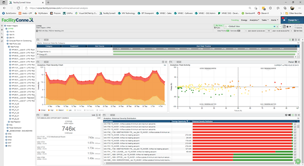
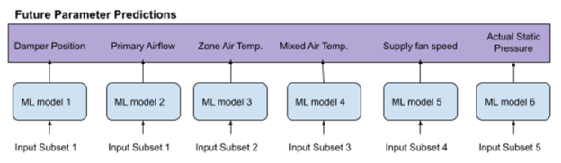
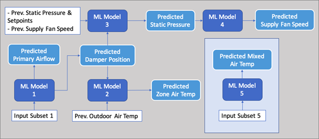
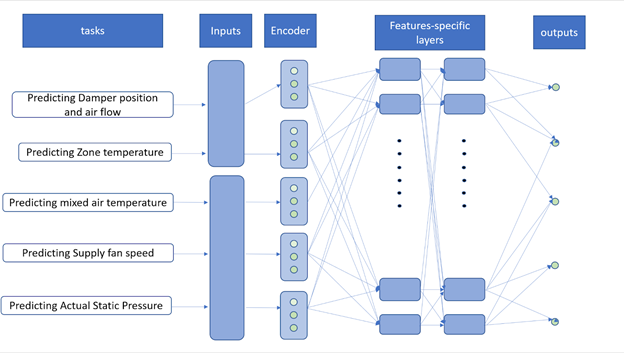
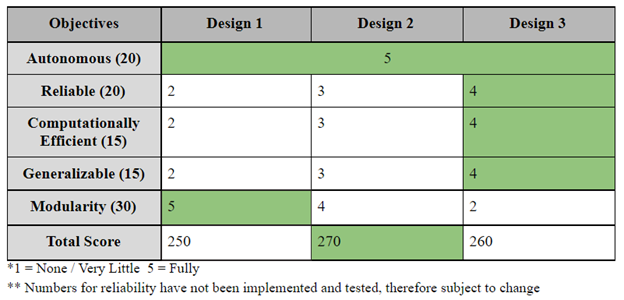

# ML-Based Predictive Maintenance Algorithm for HVAC Systems

### 2021.9 - present

## Context
[Modern Niagara Group (MNG)](https://modernniagara.com/) is a mechanical and electrical contractor that provides building maintenance services in heating, ventilation, and air conditioning (HVAC) systems. As a contractor for premium projects, MNG aims to maintain a competitive advantage through offering advanced building solutions. Particularly, the firm is expanding its integrated building technology (IBT) services, which aid in automating the control of HVAC systems. MNG hopes to drive additional value and elevate the customer experience through intelligence predictive maintenance (IPM). Thus, MNG has consulted our multidisciplinary capstone team to leverage data-driven decision making and build an in-house IPM pipeline. 

## Problem
MNG provides regular maintenance to their customers via a scheduled service approach. For other maintenance issues (i.e. abrupt faults and degradation faults), MNG is reliant on the customer’s local building operator to recognize issues and place a call to MNG’s 24/7 dispatch for reactive service. Manual fault diagnosis is a process that requires equipment downtime, which can negatively impact building occupants’ comfort. This may result in delays in regular building activities inside office towers, hospitals, and manufacturing facilities. As such, maintenance events are costly to MNG and adversely affect the satisfaction of their customers. 

## Research
Currently, MNG employs an analytics software to track metrics from the various systems in their customer’s buildings. As such, there are a multitude of system parameters being tracked and stored by MNG that are not being utilized for any function other than monitoring. These system parameters provide valuable information about the status of the building system in real-time. Before a fault occurs, the system parameters often exhibit abnormal relationships relative to each other, indicating an impending service need. Predicting these emergency maintenance events ahead of time, while the fault is in the early stage, would allow MNG to preemptively address the issue, save money through optimized repair scheduling, and improve service. 

## Narrowing the Scope
There are currently no available solutions on the market that achieve predictive maintenance. Building systems are not homogenous, and HVAC systems are complex (especially in large commercial buildings) requiring extensive engineering effort to create a digital representation of the interconnected physical systems. Therefore, the team decided to develop a proof-of-concept that the current sensor information can be applied to identifying potential failures before they occur, without manual intervention. In addition, the team has narrowed the scope to two interconnected systems: the Air Handling Central Unit (CU) and Variable Air Volume (VAV) system. Failure of the CU and VAV can cause the indoor temperature to fluctuate and negatively impact the thermal comfort of building occupants. Thus, being able to detect anomalies in the operational state of the mechanical components as well as system outputs such as zone air temperature provides valuable information on system performance. Representing the data behaviour and relationships in two complex and interconnected systems effectively demonstrates the feasibility of data-driven predictive maintenance. 

## Design Requirements

The designed pipeline will process AHU and VAV sensor data from the 17th floor of the CPPIB building to predict system outputs and identify impending system faults. The predicted system outputs from the model will represent what the AHU and VAV system on the 17th floor should look like at a certain time in the future. These predicted outputs will be compared in real-time to the measured system parameters in order to identify any anomalies or inefficiencies. 

The model’s outputs will create a digital representation of the physical system using previous operating data. If there is a significant discrepancy between the measured and predicted system parameters, the design will send an early warning to the user, which aids in scheduling maintenance. The design is also able to display ongoing metrics. 

## Alternative Designs

### Alternative Design 1: Single Target Prediction
The team identified five different tasks (groups of inputs and outputs) that are necessary in creating a digital representation of the VAV and CU systems: Zone temperature prediction, damper position and damper air flow prediction, air handling unit static pressure prediction, supply fan speed prediction, and mixed air temperature prediction. Notably, predicting each selected output only requires a subset of the input features, and therefore each sub-problem can be solved separately, learning separate smaller sets of model parameters. Since each subset of inputs and outputs has implicit biases and behaviours, the team can select the best-suited machine learning model for each task, which potentially improves accuracy. In the single target model, we treat each output variable as independent of each other, assuming no underlying relationships, or sequential order, between the target variables. Essentially, singular outputs are directly predicted using the historical dataset of the subset of input features that it depends on. 

### Alternative Design 2: Single Target Prediction
Since the goal is to create a digital twin, omitting the relationships between the tasks and target variables is insufficient to represent the VAV and CU systems. Thus, the team proposes capturing sequential relationships through using Deep Regressor Chains (DRC) for Multi Task Regression (MTR). In the DRC model, the first model is trained independently of the other target parameters, and the predicted values are added to the training set of the next target parameter that depends on it. Thus, redundancy is minimized because shared input parameters are only passed into the chain once. 

### Alternative Design 3: Multi-task Learning
To incorporate all inputs in parallel and learn variable relationships autonomously, the team proposes to apply Multi-Task Learning (MTL). MTL aims to find common features between tasks, as sharing features among tasks as a means to learning representations which capture invariant properties to tasks can be highly beneficial. Essentially, all input parameters will be encoded in the shared layers and then the MTL model will process the data into feature-specific layers. The MTL model eliminates redundancy in inputs and model parameters and allows for coupling between tasks.

After the predictions are generated, the team will identify potential anomalies, so that the operator is alerted when an outlier occurs. The team proposes using simplistic methods such as:
* Threshold-based detection based on system specifications. An alert will be generated if the predicted parameter values lie outside of a predefined range.
* Sliding-window confidence interval detection the predicted values will be compared to the actual values within a predefined sliding window of consideration. If the predicted values are outside of a predefined number of standard deviations from the actual values, an alert will be generated.

Besides the above simplistic anomaly detection methods, the team will also explore more complex statistical methods within the python Anomaly Detection Toolkit (ADTK).

## Proposed Design
Based on discussions with MNG,  the Deep Regressor Chain (DRC) model best fits the client objectives. Hence, we will create the first iteration of the digital twin using five separate machine learning models with sequential interconnections between inputs and outputs. After the digital twin produces the predictions of future parameters, we can detect anomalies between the predicted values and the actual values using threshold-based detection.

To be continued...

[Back to Projects](../projects.html)
