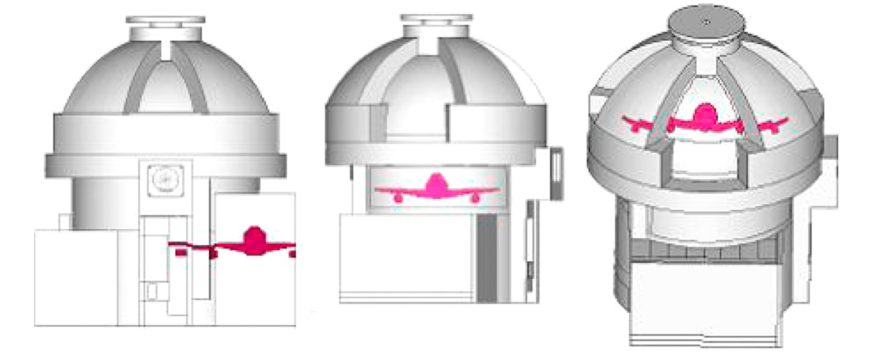

# Projects

## Aircraft Impact Analysis
### 2020.9 - present

During my ongoing internship at [Terrestrial Energy](https://www.terrestrialenergy.com/) (full-time for 1 year and currently part-time), I helped design nuclear buildings and reactor support structures for Integral Molten Salt Reactors (IMSR). Apart from detailed structural design and seismic analysis, I also worked on the research and development of aircraft impact analysis methodologies which I presented at the  [2021 Women in Nuclear Global Conference](https://womeninnuclear.com/news-events/events/2021-women-in-nuclear-global-conference/). To speed up the analysis process, I independently developed a Python script to automate aircraft impact modelling under different scenarios which significantly reduced repetitive manual work.

## Predicive Maintenance Algorithm for HVAC Systems
### 2021.9 - 2022.4

For my senior capsteone project, I am working with a multidisciplinary student team to design a predictive maintenance algorithm for HVAC and Controls Systems. We implemented an RNN-based time-series prediction model and an unsupervised anomaly detection algorithm on heating and airflow sensor data to alert operators 2 hours ahead of failure and reduce service downtime.
[Learn More](portfolio/capstone.html)

## Automatic Core Logging using Computer Vision
### 2021.4 - present

For my undergraduate thesis, I am collaborating with a mineral engineering startup called [Kore Geosystems](https://www.koregeosystems.com/) to develop a deep learning algorithm that extracts geotechnical and geological information such as RQD from core photographs using image segmentation.

## Course Search Website
### 2021.9 - 2021.11

For my Software Engineering course, I worked in a team of 5 to develop a web application named [OneCourse](https://onecourse.herokuapp.com/) using Python, HTML/CSS, and JavaScript. OneCourse is a centralized platform for finding detailed course information, engaging in course-related discussions, and developing enrolment plans. The frontend is built with Flask, and actions are completed by making REST API requests to the backend​. The backend contains microservices implemented as AWS Lamda functions which are linked with DynamoDB databases for data storage. [View Video Demo](https://youtu.be/PjRcku7ttuM)

## Real-Time Mask Detection
### 2021.5 - 2021.8

For my Applied Fundamentals of Machine Learning course, I developed a real-time face mask detection model using the SSD-MobileNetV2 architecture. The model automades the screening process for mask mandates by not only identifying whether a mask is worn properly, but also classifying the type of mask being worn. In a group of 4, we also implemented the detection model as an iOS application to evaluate the model’s performance in actual use cases.

## Bikeshare Usage Prediction
### 2021.5 - 2021.8

For my Data Science for Civil Engineers course, I worked with 2 other students to analyze bike-share data in Toronto from 2017 to 2020. We performed data cleaning, exploratory analysis, and modelling to predict hourly ridership demand. We then used the insights from historic data to inform the feasibility of expanding the bike-share program in the future. I summarized our process and findings in a [Medium article](https://shirleyzhang2.medium.com/toronto-bike-share-data-analysis-943d5810c717).

## DesignCheck
### 2020.6 - 2020.7

During my summer internship at [Arup](https://www.arup.com/), I contributed to [DesignCheck](https://www.autodesk.com/autodesk-university/class/Dynamo-Engineers-Design-All-2018), a C# platform that performs user-defined engineering calculations and creates formatted reports via dynamically generated web APIs. By building a centralized hub of calculations to iterate and control design processes, DesignCheck helps inform, improve, and accelerate project delivery. [(video demo)](https://www.youtube.com/watch?v=tQEU4uQOVuI)

## Settle3
### 2019.5 - 2019.8

During my summer internship at [Rocscience](https://www.rocscience.com/), I developed <a href=".\docs\pdf\Settle3_update.pdf">ground improvement and settlement calculation features</a> for a 3D Soil Analysis Software called [Settle3](https://www.rocscience.com/software/settle3) using C++. My contributions involved literary review, backend development, user interface design, and documentation.

## Autobuilder
### 2019.5 - 2021.4

As a co-captain for the [UofT Seismic Design Team](http://seismic.skule.ca/), I worked with 3 other members to develop "Autobuilder", an in-house Python program with a Qt interface that can automatically create thousands of design iterations based on user-defined constraints. By removing repetition in manual modelling efforts and accelerating project delivery, Autobuilder helped us achieve 3rd place out of 37 international teams at the [2021 Undergraduate Seismic Design Competition](https://slc.eeri.org/2021-sdc/).

## Canoe Design
### 2018.9 - 2021.5

As the technical director for the [UofT Concrete Canoe Team](https://canoe.skule.ca/), I leveraged MATLAB to determine the levels of stress experienced by the canoe in a variety of static and dynamic loading cases such as construction, transport, and paddling.  I also helped develop a C++ program that optimizes hull geometry by balancing maneuverability and fluid resistance. In 2021, our team won 2nd place at the [Canadian National Concrete Canoe Competition](https://www.cscecompetitions.ca/en/home/cnccc/).    

[Back to home](/)