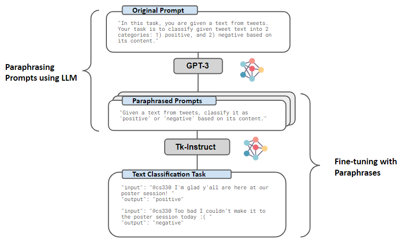
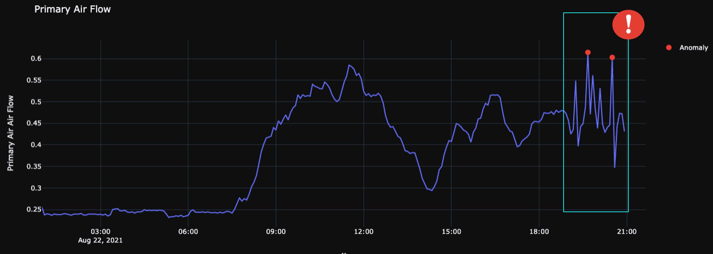

# Projects

## Concrete Design Optimization
### 2023.01-2023.03

During my summer internship at [Arup's LA office](https://www.arup.com/offices/united-states-of-america/los-angeles), I contributed to the digital design delivery on the BART Silicon Valley Phase II megaproject. Working closely with the Bridges & Civil Structures Team, we deployed data-driven workflows using Python, SQL and Grasshopper scripts to automate and accelerate the processing of FEA models and engineering calculations. I also designed and launched a holistic framework for leadership to measure whether our digital initiatives are delivering business results.

## Concrete Design Optimization
### 2023.01-2023.03

In my AI Applications in the AEC Industry course, I worked with a start-up named [Structure Pal](https://www.structure-pal.com/) to develop a data science workflow that predicts the most efficient reinforced concrete column cross-sections using building characteristics. In the client's words, my solution enabled them to "learn new things about their data, and they can now consider new methods to deploy in their software for better and faster results".

## Natural Language Prompts for Text Classification
### 2022.9-2022.12

For my [Deep Multi-Task and Meta Learning](https://cs330.stanford.edu/) class project, I worked with two CS graduate students to improve natural language promptsfor more robust multi-task text classfication. We generated high-quality prompt paraphrases using GPT-3, trained a prompt quality prediction model using a RoBERTa-base backbone + regression head to identify the best paraphrase, then finetuned a pre-trained Tk-Instruct model on paraphrased prompts to reduce its sensitivity to different wordings. <a href=".\docs\pdf\CS330 Poster.jpg">[View poster]</a>
[[View Github repo]](https://github.com/shirleyzhang2/CS330-Project)

## Nuclear Plant Structural Design
### 2020.9 - 2022.8

During my 2-year internship at [Terrestrial Energy](https://www.terrestrialenergy.com/) (full-time for 1 year and part-time during school), I helped design nuclear buildings and reactor support structures for Integral Molten Salt Reactors (IMSR). Apart from reinforced concrete and steel design as well as seismic analysis, I also worked on the research and development of aircraft impact analysis methodologies which I presented at the 2021 [Women in Nuclear Global Conference](https://win-global.org/activities/annual). To speed up the analysis process, I developed a Python script to automate aircraft impact modelling under different scenarios which significantly reduced repetitive manual work.

## Predicive Maintenance Algorithm for HVAC Systems
### 2021.9 - 2022.4

For my senior capstone project, I worked with a building services company ([Modern Niagara Group](https://modernniagara.com/)) and a multidisciplinary student team to design a predictive maintenance algorithm for HVAC and Controls Systems. We implemented an RNN-based time-series prediction model and an unsupervised anomaly detection algorithm on heating and airflow sensor data to alert operators 2 hours ahead of failure and reduce service downtime. <a href=".\docs\pdf\APS490 Poster - Team MNG.pdf">[View poster]</a>
<!--[Learn More](portfolio/capstone.html)-->

## Automatic Core Logging using Computer Vision
### 2021.4 - 2022.4

For my undergraduate thesis, I collaborated with a mineral engineering startup called [Kore Geosystems](https://www.koregeosystems.com/) to develop a deep learning algorithm that extracts geotechnical and geological information such as RQD from core photographs using image segmentation. I also deployed the ML model as a web application. <a href=".\docs\pdf\CME499_Thesis_SZ-compressed.pdf">[View Thesis]</a>

## Course Search Website
### 2021.9 - 2021.11

For my Software Engineering course, I worked in a team of 5 to develop a web application named [OneCourse](https://onecourse.herokuapp.com/) using Python, HTML/CSS, and JavaScript. OneCourse is a centralized platform for finding detailed course information, engaging in course-related discussions, and developing enrolment plans. The frontend is built with Flask, and actions are completed by making REST API requests to the backend​. The backend contains microservices implemented as AWS Lamda functions which are linked with DynamoDB databases for data storage. Our project was voted Top 3 by classmates and won a bonus mark! [[View Github repo]](https://github.com/shirleyzhang2/project1-education-pathways-group-1-teamone) [[View video demo]](https://youtu.be/PjRcku7ttuM)

## Real-Time Mask Detection
### 2021.5 - 2021.8

For my Applied Fundamentals of Machine Learning course, I developed a real-time face mask detection model using the SSD-MobileNetV2 architecture. The model automades the screening process for mask mandates by not only identifying whether a mask is worn properly, but also classifying the type of mask being worn. In a group of 4, we also implemented the detection model as an iOS application to evaluate the model’s performance in actual use cases. <a href=".\docs\pdf\APS360_Report.pdf">[View final report]</a>

## Bikeshare Usage Prediction
### 2021.5 - 2021.8

For my Data Science for Civil Engineers course, I worked with 2 other students to analyze bike-share data in Toronto from 2017 to 2020. We performed data cleaning, exploratory analysis, and modelling to predict hourly ridership demand. We then used the insights from historic data to inform the feasibility of expanding the bike-share program in the future. [[View Medium article]](https://shirleyzhang2.medium.com/toronto-bike-share-data-analysis-943d5810c717).

## DesignCheck
### 2020.6 - 2020.7

During my summer internship at [Arup](https://www.arup.com/), I contributed to [DesignCheck](https://www.autodesk.com/autodesk-university/class/Dynamo-Engineers-Design-All-2018), a C# platform that performs user-defined engineering calculations and creates formatted reports via dynamically generated web APIs. By building a centralized hub of calculations to iterate and control design processes, DesignCheck helps inform, improve, and accelerate project delivery. [[View video demo]](https://www.youtube.com/watch?v=tQEU4uQOVuI)

## Settle3
### 2019.5 - 2019.8

During my summer internship at [Rocscience](https://www.rocscience.com/), I developed ground improvement and settlement calculation features for a 3D Soil Analysis Software called [Settle3](https://www.rocscience.com/software/settle3) using C++. My contributions involved literary review, backend development, user interface design, and documentation. <a href=".\docs\pdf\Settle3_update.pdf">[View product update]</a>

## Autobuilder
### 2019.5 - 2021.4

As a co-captain for the [UofT Seismic Design Team](http://seismic.skule.ca/), I worked with 3 other members to develop "Autobuilder", an in-house Python program with a Qt interface that can automatically create thousands of design iterations based on user-defined constraints. By removing repetition in manual modelling efforts and accelerating project delivery, Autobuilder helped us achieve 3rd place out of 37 international teams at the [2021 Undergraduate Seismic Design Competition](https://slc.eeri.org/2021-sdc/).

## Canoe Design
### 2018.9 - 2021.5

As the technical director for the [UofT Concrete Canoe Team](https://canoe.skule.ca/), I leveraged MATLAB to determine the levels of stress experienced by the canoe in a variety of static and dynamic loading cases such as construction, transport, and paddling.  I also helped develop a C++ program that optimizes hull geometry by balancing maneuverability and fluid resistance. In 2021, our team won 2nd place at the [Canadian National Concrete Canoe Competition](https://www.cscecompetitions.ca/en/home/cnccc/).    

[Back to home](/)